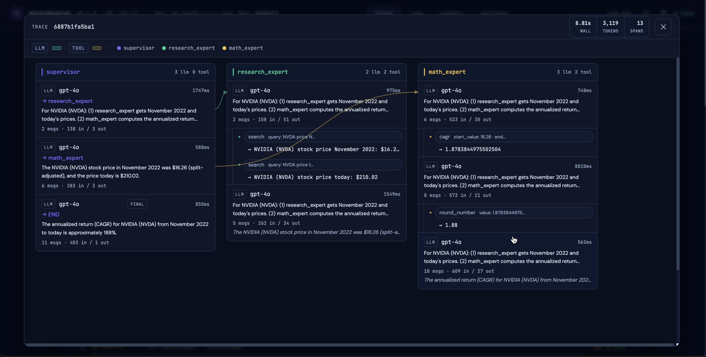

# 🔭 MiniObserve

**Local-first observability for AI agents and LLM apps.**

SQLite by default. No account. No subscription. Optional cloud setup. Supabase support with one env var change.

```bash
cd backend && pip install -r requirements.txt
uvicorn main:app --host 0.0.0.0 --port 7823
# open http://localhost:7823
```

---

## Who this is for

You're building or experimenting with AI agents and you want to know what's actually happening under the hood.

You want to:
- See every LLM call, tool call, and agent step — in order, with timings
- Know which calls are burning tokens and costing money
- Spot when your agent is looping, stuck, or waiting on a slow tool
- Check if prompt caching is actually working
- Keep your data on your own machine

You don't want to:
- Send data to a third-party observability platform
- Pay for yet another subscription
- Deal with infra or configuration

---

## Getting Started - Point your coding agent to Agents.md

The fastest way to add MiniObserve to your app is to let your coding agent do it.

Clone this repo and drag and drop `AGENTS.md` into your coding agent. Then tell it:
> *"Read AGENTS.md and instrument my app with miniobserve."*

The agent will handle installation, setup, and wiring the SDK into your code.

---

## Example trace



---

## Manual setup

**Step 1 — Start the backend** (the dashboard + ingest API)

```bash
cd backend && pip install -r requirements.txt
uvicorn main:app --host 0.0.0.0 --port 7823
```

**Step 2 — Install the SDK**

```bash
pip install miniobserve
# For LangChain / LangGraph:
pip install "miniobserve[langchain]"
```

**Step 3 — Verify the connection**

```bash
miniobserve hello
```

Open [http://localhost:7823](http://localhost:7823) — you'll see a test ping appear in the dashboard.

> **This does not add tracing to your app.** It just confirms the server is reachable.
> To actually capture your agent's LLM calls, tool calls, and steps — point your coding agent at [`AGENTS.md`](AGENTS.md). For a LangGraph app it's 3–4 lines added to your existing `graph.invoke()`. For custom agents it's a lightweight `Tracer` wrapper.

---


## What you get

- **Run timeline** — every LLM call, tool call, and agent step in order with latency
- **Cognitive phases** — per-span classification: thinking / calling / synthesizing / executing
- **Cost tracking** — per-call and per-run cost estimates with cached vs. uncached token breakdown
- **Stuck & waiting detection** — flags when your agent loops on the same tool or waits on a slow one
- **Prompt cache visibility** — see cache hit rates across a run at a glance
- **Trace view** — drill into any span for the full prompt, response, tool args, and metadata

---

## FAQ

**Is my data private?**
Yes — in local mode (SQLite, default) nothing leaves your machine. No telemetry, no external calls.

**How do API keys work?**
In local mode the server accepts requests with no key or with `Bearer sk-local-default-key`. If you want to separate traces by app or share with teammates, set `MINIOBSERVE_API_KEYS="sk_abc123:my-app"` in `backend/.env`. Each key maps to an app name; logs are scoped per app. See [AGENTS.md](AGENTS.md) for details.

**What are the colored phase labels I see in a run trace?**

| Phase | What it means |
|---|---|
| **thinking** | LLM reasoning before any tools have run |
| **calling** | LLM emitting tool calls |
| **synthesizing** | LLM integrating tool results into a response |
| **executing** | A tool or child-agent doing real work |
| **unclassified** | Span didn't match any heuristic |

`cognitive_waiting` and `cognitive_stuck` are flags, not phases — they appear when a tool is unusually slow or the agent repeats the same tool call with the same arguments.

**Which AI providers are supported?**

| Provider | Support |
|---|---|
| OpenAI (gpt-4o, gpt-4o-mini, gpt-4.1, o3, o4-mini) | Full — cost estimates + token normalization |
| Anthropic (claude-3-5-sonnet, claude-3-5-haiku, claude-opus-4) | Full — cost estimates + token normalization |
| OpenRouter | Passthrough — cost estimated when model matches OpenAI/Anthropic pricing |
| Ollama | Passthrough — stored with zero cost |

**Can I use this without the Python SDK?**
Yes — any language can send spans via `POST /api/log` or `POST /api/logs`. Full schema at `/docs` on the running server.

---

## Storage

**SQLite (default)** — zero config, data at `~/.miniobserve/logs.db`. Just run the backend.

**Supabase** — for multi-device, shared teams, or cloud hosting:

```bash
export MINIOBSERVE_BACKEND=supabase
export SUPABASE_URL=https://<project>.supabase.co
export SUPABASE_SERVICE_ROLE_KEY=eyJ...
cd backend && uvicorn main:app --host 0.0.0.0 --port 7823
```

Run `backend/supabase_schema.sql` once in the Supabase SQL editor first.

Note: You can run supabase as db instead of sqllite by just changing the env variable. The app will run locally and will use supabase backend if you need a more robust database. Use the supabase_schema.sql file to create the db.

See [HOSTING.md](HOSTING.md) for Docker, HTTPS, and production setup.

---

## License

[MIT](LICENSE)
